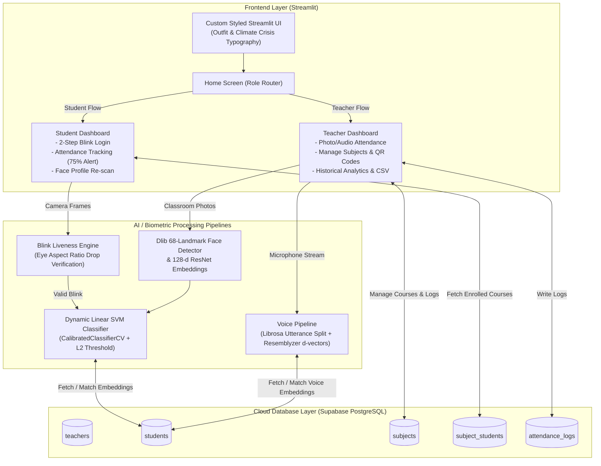

<div align="center">


# SnapClass
### Making Attendance Faster & Smarter Using Multimodal AI

[](https://snapclass-attendance-simplified.streamlit.app)
[](https://www.python.org/)
[](https://supabase.com/)
[](http://dlib.net/)
[](https://scikit-learn.org/)
[](https://opensource.org/licenses/MIT)

<p align="center">
  <b>SnapClass</b> is an intelligent, high-speed classroom attendance and management platform.<br/>
  Powered by <b>Facial Recognition with Anti-Spoofing Liveness Verification</b>, <b>Speaker Voice Identification</b>, and seamless <b>Supabase Cloud Persistence</b>.
</p>

[Key Features](#-key-features) • [System Architecture](#-system-architecture) • [AI Pipelines Deep Dive](#-ai-pipelines-deep-dive) • [Database Schema](#-database-schema) • [Installation & Setup](#-installation--setup) • [Folder Structure](#-project-structure)

---

</div>

## 📌 Overview

Traditional classroom roll-calls are tedious, time-consuming, and prone to proxy attendance. **SnapClass** eliminates roll-call overhead by providing:
- **Instant Classroom Attendance**: Teachers can take one or more wide-angle classroom photos or record room audio to mark present students simultaneously within seconds.
- **Biometric Student Authentication**: Students sign in seamlessly using facial verification protected by a **two-step blink-based liveness test** that prevents photo or screen spoofs.
- **Course & Analytics Management**: Live tracking of attendance thresholds with warning indicators for attendance below 75%, QR-code course invitations, and one-click CSV report exports.

---

## ✨ Key Features

### 👨‍🏫 Teacher Portal
- **Multimodal Attendance Taking**:
  - **Multi-Photo Classroom Scan**: Upload or capture multiple wide-angle classroom shots; the AI cross-references all photos to identify students sitting across different rows.
  - **Voice Attendance Scan**: Records continuous room speech (e.g. students answering "Present!"), segments each utterance using `librosa`, and matches voice embeddings using `resemblyzer`.
  - **Interactive Confirmation Dialog**: Visual review of detected vs. absent students with source attribution (e.g., `Photo 1`, `Photo 2`) before committing records to the database.
- **Subject & Course Administration**:
  - Create subjects with unique subject codes (e.g. `CS101`, Section `A`).
  - Generate instant **Segno QR codes** and shareable direct-enrollment links (`/?join-code=<CODE>`).
- **Attendance Records & Export**:
  - View historical session attendance rates with aggregated student counts.
  - Download timestamped attendance reports directly as **CSV** files (`Attendance_Report_YYYYMMDD.csv`).
- **Teacher Security & Account Recovery**:
  - Bcrypt-hashed credentials with password strength rules (minimum 8 chars, uppercase, lowercase, number).
  - 3-step **Forgot Password flow** using security questions and answers (case-insensitive bcrypt verification).

---

### 🧑‍🎓 Student Portal
- **Blink-Based Liveness Verification**:
  - Two-step interactive challenge: Step 1 (Eyes Open) $\rightarrow$ Step 2 (Eyes Closed).
  - Eye Aspect Ratio (EAR) validation ensures physical presence, blocking static digital photos or phone screen replays.
- **Duplicate Biometric Prevention**:
  - Compares new face encodings against the existing student database ($L_2$ Euclidean distance) to block duplicate registrations under different names.
- **Self-Service Biometric Updates**:
  - Students can capture a fresh snapshot to re-scan and update their stored facial embeddings at any time.
- **Attendance Tracking & Alerts**:
  - View enrolled subjects with real-time attendance percentage cards.
  - Automatic status badges: 📈 **Safe** ($\ge 75\%$) vs. ⚠️ **Low Attendance Alert** ($< 75\%$).
- **Frictionless Enrollment**:
  - One-click join dialog via manual subject code or auto-prompted via deep-linked QR code.
  - Safe unenrollment workflow with confirmation dialogs.

---

## 🏗️ System Architecture



---

## 🧠 AI Pipelines Deep Dive

### 1. Facial Recognition & Classification (`face_pipeline.py`)
- **Detection & Landmarks**: Uses Dlib’s HOG-based `get_frontal_face_detector()` coupled with a 68-point facial landmark shape predictor from `face_recognition_models`.
- **128-d Feature Descriptors**: Computes a 128-dimensional biometric embedding vector for each detected face.
- **Hybrid Matching**:
  - Trains an `sklearn.calibration.CalibratedClassifierCV` wrapper around a linear `SVC(class_weight='balanced')` dynamically on registered student face vectors.
  - Validates predictions using an $L_2$ Euclidean distance threshold ($\le 0.60$) against known training centroids to reject unrecognized faces or impostors.
- **Visual Bounding Boxes**: Classroom images are annotated in real time:
  - 🟢 **Emerald Green (`#2ECC71`)**: Recognized enrolled student with their name.
  - 🔴 **Crimson Red (`#E74C3C`)**: Unregistered / unrecognized individual.
  - 🟡 **Amber (`#F39C12`)**: Face detected before model training.

### 2. Anti-Spoofing Blink Liveness Detection
To prevent proxy attendance using printed photos or smartphone displays, SnapClass implements landmark-based **Eye Aspect Ratio (EAR)** calculation:

$$\text{EAR} = \frac{\|p_1 - p_5\| + \|p_2 - p_4\|}{2 \cdot \|p_0 - p_3\|}$$

*(where $p_0 \dots p_5$ are 2D landmark coordinates for eye corners and eyelids)*

- **Stage 1**: Capture eyes-open photo $\rightarrow$ compute $\text{EAR}_{\text{open}}$ (typically $0.20 - 0.35$).
- **Stage 2**: Capture eyes-closed photo $\rightarrow$ compute $\text{EAR}_{\text{closed}}$ (typically $0.02 - 0.15$).
- **Verification Rule**:
  1. Identity consistency check: Face distance between both captures must be $\le 0.60$.
  2. Blink drop check: Relative drop $\frac{\text{EAR}_{\text{open}} - \text{EAR}_{\text{closed}}}{\text{EAR}_{\text{open}}} \ge 18\%$ OR absolute drop $\ge 0.035$.
  Static screens or printed photos cannot produce this delta, rejecting spoofing attempts immediately.

### 3. Voice Biometrics & Utterance Splitting (`voice_pipeline.py`)
- **Utterance Segmentation**: Classroom audio streams are processed using `librosa.effects.split(audio, top_db=30)` to isolate vocal segments $> 0.5\text{ seconds}$.
- **Deep Speaker Embeddings**: Runs preprocessed audio through `resemblyzer.VoiceEncoder` to generate 256-dimensional d-vectors.
- **Speaker Identification**: Computes cosine similarity via vector dot product against enrolled candidates. Utterances scoring $\ge 0.65$ are mapped to student IDs.

---

## 🗄️ Database Schema

SnapClass runs on **Supabase PostgreSQL**. Create the tables below in your **Supabase Dashboard $\rightarrow$ SQL Editor**:

```sql
-- 1. Teachers Table
CREATE TABLE teachers (
    teacher_id BIGINT GENERATED BY DEFAULT AS IDENTITY PRIMARY KEY,
    username TEXT UNIQUE NOT NULL,
    name TEXT NOT NULL,
    email TEXT UNIQUE,
    password TEXT NOT NULL,
    security_question TEXT,
    security_answer TEXT,
    created_at TIMESTAMPTZ DEFAULT NOW()
);

-- 2. Students Table
CREATE TABLE students (
    student_id BIGINT GENERATED BY DEFAULT AS IDENTITY PRIMARY KEY,
    name TEXT NOT NULL,
    face_embedding JSONB,      -- 128-dimensional array of floats
    voice_embedding JSONB,     -- 256-dimensional array of floats
    created_at TIMESTAMPTZ DEFAULT NOW()
);

-- 3. Subjects Table
CREATE TABLE subjects (
    subject_id BIGINT GENERATED BY DEFAULT AS IDENTITY PRIMARY KEY,
    subject_code TEXT NOT NULL,
    name TEXT NOT NULL,
    section TEXT NOT NULL,
    teacher_id BIGINT REFERENCES teachers(teacher_id) ON DELETE CASCADE,
    created_at TIMESTAMPTZ DEFAULT NOW()
);

-- 4. Student Course Enrollment (Junction Table)
CREATE TABLE subject_students (
    id BIGINT GENERATED BY DEFAULT AS IDENTITY PRIMARY KEY,
    student_id BIGINT REFERENCES students(student_id) ON DELETE CASCADE,
    subject_id BIGINT REFERENCES subjects(subject_id) ON DELETE CASCADE,
    created_at TIMESTAMPTZ DEFAULT NOW(),
    UNIQUE(student_id, subject_id)
);

-- 5. Attendance Logs Table
CREATE TABLE attendance_logs (
    log_id BIGINT GENERATED BY DEFAULT AS IDENTITY PRIMARY KEY,
    student_id BIGINT REFERENCES students(student_id) ON DELETE CASCADE,
    subject_id BIGINT REFERENCES subjects(subject_id) ON DELETE CASCADE,
    timestamp TEXT NOT NULL,
    is_present BOOLEAN NOT NULL DEFAULT FALSE,
    created_at TIMESTAMPTZ DEFAULT NOW()
);
```

> **Note on Row Level Security (RLS)**: If RLS is enabled on your Supabase tables, create appropriate policies permitting authenticated or anon key access for read/write operations, or run:
> ```sql
> ALTER TABLE students DISABLE ROW LEVEL SECURITY;
> ALTER TABLE teachers DISABLE ROW LEVEL SECURITY;
> ALTER TABLE subjects DISABLE ROW LEVEL SECURITY;
> ALTER TABLE subject_students DISABLE ROW LEVEL SECURITY;
> ALTER TABLE attendance_logs DISABLE ROW LEVEL SECURITY;
> ```

---

## 🚀 Installation & Setup

### Prerequisites
- **Python 3.10** or higher recommended
- **C++ Build Tools & CMake** (required for `dlib` compilation if building from source):
  - **Windows**: Visual Studio Community with *Desktop development with C++* and [CMake](https://cmake.org/download/).
  - **macOS**: `xcode-select --install && brew install cmake`
  - **Linux (Ubuntu/Debian)**: `sudo apt-get install build-essential cmake libopenblas-dev liblapack-dev`

### 1. Clone the Repository
```bash
git clone https://github.com/Rish2103/SnapClass.git
cd SnapClass
```

### 2. Create and Activate a Virtual Environment
```bash
# Windows (PowerShell)
python -m venv venv
.\venv\Scripts\Activate.ps1

# macOS / Linux
python3 -m venv venv
source venv/bin/activate
```

### 3. Install Dependencies
```bash
pip install --upgrade pip setuptools wheel
pip install -r requirements.txt
```

> [!TIP]
> If you encounter issues installing `dlib` on Windows, `requirements.txt` utilizes the precompiled `dlib-bin` package. For other platforms, standard `pip install dlib` works once CMake is installed.

### 4. Configure Supabase Credentials
Create a `.streamlit/secrets.toml` file in the root directory:

```toml
SUPABASE_URL = "https://your-project-id.supabase.co"
SUPABASE_KEY = "your-supabase-anon-or-service-role-key"
```

*(Note: `.streamlit/secrets.toml` is already included in `.gitignore` to protect your credentials).*

### 5. Run the Application
```bash
streamlit run app.py
```
Open your browser at `http://localhost:8501`.

---

## 📁 Project Structure

```text
SnapClass/
├── .streamlit/
│   ├── config.toml                # Streamlit light mode & theme configurations
│   └── secrets.toml               # Supabase credentials (git-ignored)
├── src/
│   ├── database/
│   │   ├── config.py              # Supabase client initialization
│   │   └── db.py                  # Database CRUD queries, bcrypt auth & password rules
│   ├── pipelines/
│   │   ├── face_pipeline.py       # Dlib 68-pt landmarks, ResNet embeddings, EAR liveness & SVM
│   │   └── voice_pipeline.py      # Resemblyzer d-vectors, Librosa segmentation & similarity
│   ├── screens/
│   │   ├── components/
│   │   │   ├── dialogue_add_photo.py          # Camera snapshot & file upload modal
│   │   │   ├── dialogue_attendance_results.py # Attendance review & sync modal
│   │   │   ├── dialogue_auto_enroll.py        # Deep-link QR auto-enrollment modal
│   │   │   ├── dialogue_create_subjects.py    # Course creation modal
│   │   │   ├── dialogue_enroll.py             # Student manual course join modal
│   │   │   ├── dialogue_share_subjects.py     # Segno QR code generator modal
│   │   │   ├── dialogue_unenroll.py           # Confirmation dialog to leave a course
│   │   │   ├── dialogue_voice_attendance.py   # Classroom voice recording modal
│   │   │   ├── footer.py                      # Consistent UI footer
│   │   │   ├── header.py                      # Header with brand logo
│   │   │   └── subject_card.py                # Card component with 75% attendance badges
│   │   ├── ui/
│   │   │   └── base_layout.py     # Custom CSS styles, Google fonts & styled alert boxes
│   │   ├── home_screen.py         # Role selector landing view
│   │   ├── student_screen.py      # Student authentication, blink verification & dashboard
│   │   └── teacher_screen.py      # Teacher login/registration, forgot password & 3-tab dashboard
│   └── __init__.py
├── .gitignore                     # Git ignore rules (secrets, venv, pycache)
├── app.py                         # Streamlit application entry point & router
├── requirements.txt               # Python package dependencies
└── README.md                      # Project documentation
```

---

## 🎨 UI Design System

SnapClass features a responsive, Discord-inspired visual aesthetic built on custom CSS injection:
- **Primary Font**: [Outfit](https://fonts.google.com/specimen/Outfit) for legible, modern body copy and dashboard cards.
- **Display Font**: [Climate Crisis](https://fonts.google.com/specimen/Climate+Crisis) for distinctive typographic headers.
- **Curated Palette**:
  - Primary Accent: `#5865F2` (Blurple)
  - Secondary Accent: `#EB459E` (Pink)
  - Surface Background: `#E0E3FF` (Light Periwinkle)
  - Deep Tone: `#071645` (Navy)
  - Success Indicator: `#2ECC71` / `#117A65` (Emerald)
  - Danger / Alert: `#FF4D6D` / `#C0113B` (Crimson)
- **Interactive Micro-Interactions**: Hover scaling, soft card drop-shadows, and customized status banners for `@st.dialog` modals.

---

## 🛡️ Security & Privacy

1. **Cryptographic Hashing**: All teacher passwords and security recovery answers are hashed using `bcrypt` with unique salts. Passwords are never stored in plaintext.
2. **Biometric Data Safeguards**: Raw camera and microphone captures are processed in-memory to compute numerical vectors; raw image/audio files are not retained on disk.
3. **Password Complexity**: Enforces a minimum of 8 characters containing uppercase, lowercase, and numeric characters.
4. **Spoof Resistance**: Strict EAR blink liveness threshold prevents presentation attacks via printed headshots or smartphone playback.

---

## 🤝 Contributing

Contributions are welcome! If you'd like to improve SnapClass:
1. Fork the repository.
2. Create a feature branch (`git checkout -b feature/AmazingFeature`).
3. Commit your changes (`git commit -m 'Add some AmazingFeature'`).
4. Push to the branch (`git push origin feature/AmazingFeature`).
5. Open a Pull Request.

---

## 📄 License

This project is licensed under the MIT License — see the [LICENSE](LICENSE) file for details.

---

<div align="center">
  <b>Developed with ❤️ by <a href="https://github.com/Rish2103">Rishabh</a></b>
</div>
